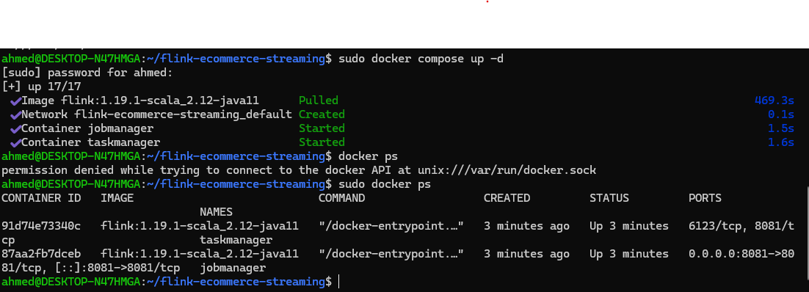
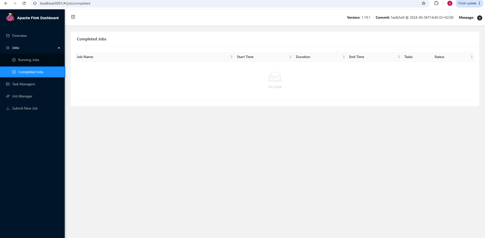
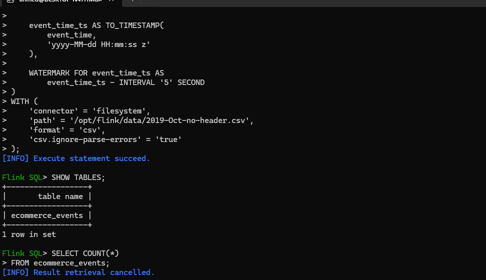
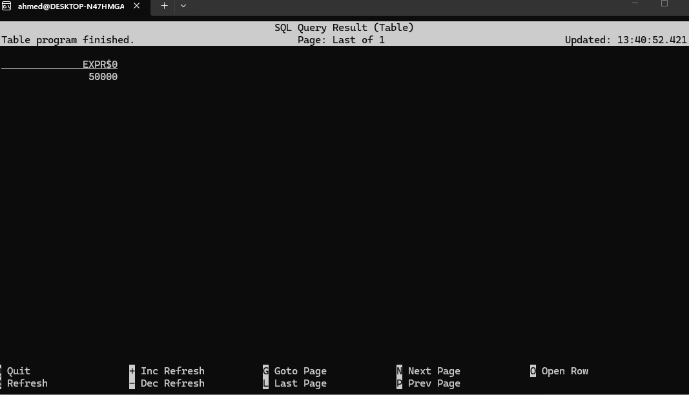
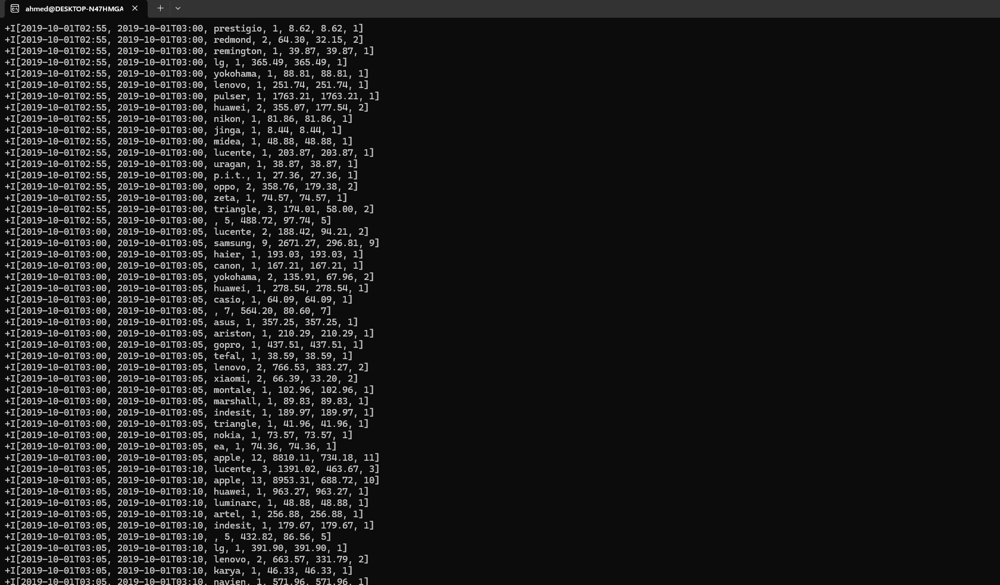
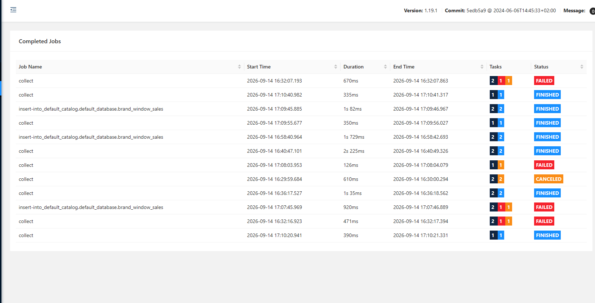

# Flink E-commerce Streaming Analytics

A real-time style e-commerce analytics pipeline built with **Apache Flink SQL** and **Docker**.

The project processes the **eCommerce Events History in Cosmetics Shop** dataset and demonstrates how Flink can perform event-time analytics using **Watermarks**, **Tumbling Windows**, and SQL aggregations.

---

## Project Overview

The pipeline reads e-commerce events from CSV files, converts the original event timestamp into an Event-Time attribute, applies a 5-second watermark, and calculates sales metrics for every brand over 5-minute tumbling windows.

### Pipeline

```text
Kaggle E-commerce Dataset
          │
          ▼
2019-Oct-no-header.csv
          │
          ▼
Flink Filesystem Source
          │
          ▼
ecommerce_events
          │
          ▼
Event Time + Watermark
          │
          ▼
5-Minute TUMBLE Window
          │
          ▼
Purchase Events
          │
          ▼
Brand Aggregation
          │
          ▼
brand_window_sales
          │
          ▼
CSV Output
```

---

## Technologies

| Technology          | Purpose                           |
| ------------------- | --------------------------------- |
| Apache Flink 1.19.1 | Stream processing                 |
| Flink SQL           | Data transformation and analytics |
| Docker              | Flink cluster environment         |
| Docker Compose      | Container orchestration           |
| CSV                 | Source and output format          |
| Event Time          | Time-based event processing       |
| Watermarks          | Handling late/out-of-order events |
| TUMBLE Windows      | Fixed 5-minute aggregations       |

---

## Architecture

The project runs a small Flink cluster using Docker Compose:

```text
                    Flink Cluster
                         │
             ┌───────────┴───────────┐
             │                       │
        JobManager              TaskManager
             │                       │
       Coordinates              Executes
        the jobs                the tasks
             │                       │
             └───────────┬───────────┘
                         │
                         ▼
                 Flink SQL Pipeline
```

### JobManager

* Coordinates Flink jobs
* Provides the Flink Web UI
* Available at `http://localhost:8081`

### TaskManager

* Executes the actual processing tasks
* Provides task slots for parallel execution

---

## Dataset

The project uses the Kaggle dataset:

**eCommerce Events History in Cosmetics Shop**

The original dataset contains fields such as:

```text
event_time
event_type
product_id
category_id
category_code
brand
price
user_id
user_session
```

The dataset contains real-world characteristics such as missing values and events that may not arrive in Event-Time order, making it useful for demonstrating Flink's event-time processing.

---

## Event Time & Watermarks

The original `event_time` field is stored as a string:

```text
2019-10-01 00:00:00 UTC
```

It is converted into a Flink timestamp:

```sql
event_time_ts AS TO_TIMESTAMP(
    event_time,
    'yyyy-MM-dd HH:mm:ss z'
)
```

The pipeline then defines a 5-second watermark:

```sql
WATERMARK FOR event_time_ts AS
    event_time_ts - INTERVAL '5' SECOND
```

The watermark allows Flink to make progress in Event Time while accounting for events that arrive slightly out of order.

### Watermark vs Window

These two settings have different purposes:

```text
5 seconds  → Watermark / Event-Time progress
5 minutes  → Aggregation window
```

---

## 5-Minute Tumbling Window

The pipeline uses a **TUMBLE window**:

```sql
TUMBLE(
    TABLE ecommerce_events,
    DESCRIPTOR(event_time_ts),
    INTERVAL '5' MINUTES
)
```

Tumbling windows are fixed-size, non-overlapping windows:

```text
03:30 ───────── 03:35
       Window 1

03:35 ───────── 03:40
       Window 2

03:40 ───────── 03:45
       Window 3
```

Each purchase event belongs to one 5-minute Event-Time window.

---

## Sales Metrics

Only purchase events are included:

```sql
WHERE event_type = 'purchase'
```

The pipeline calculates:

### Total Orders

```sql
COUNT(*)
```

Number of purchase records within the window.

### Gross Revenue

```sql
SUM(price)
```

Total purchase value within the window.

### Average Order Value

```sql
AVG(price)
```

Average purchase price within the window.

### Unique Buyers

```sql
COUNT(DISTINCT user_id)
```

Number of distinct customers who made purchases.

---

## Example Result

Example output for a single brand and window:

```text
Window Start:     2019-10-01 03:30:00
Window End:       2019-10-01 03:35:00
Brand:            samsung
Total Orders:     10
Gross Revenue:    3055.86
Average Value:    305.59
Unique Buyers:    9
```

This represents 10 purchase events from 9 distinct buyers during the five-minute Event-Time window, with total revenue of 3055.86.

---

## Project Structure

```text
flink-ecommerce-streaming/
│
├── sql/
│   └── flink_ecommerce_pipeline.sql
│
├── data/
│   ├── 2019-Oct.csv
│   └── 2019-Oct-no-header.csv
│
├── output/
│   └── brand_window_sales/
│
├── screenshots/
│   ├── 01-docker-containers-running.png
│   ├── 02-flink-web-ui.png
│   ├── 03-flink-sql-query.png
│   ├── 04-source-query-result.png
│   ├── 05-Result View.png
│   ├── 05-tumble-window-result.png
│   └── 06-flink-job-finished.png
│
├── docker-compose.yml
├── README.md
└── PROBLEMS.md
```

---

## Running the Project

### 1. Clone the repository

```bash
git clone https://github.com/AhmedIslamElsayes/flink-ecommerce-streaming.git
cd flink-ecommerce-streaming
```

### 2. Start Flink

```bash
docker compose up -d
```

Check the containers:

```bash
docker ps
```

Expected services:

```text
jobmanager
taskmanager
```

### 3. Open Flink Web UI

Open:

```text
http://localhost:8081
```

### 4. Start Flink SQL Client

```bash
docker exec -it jobmanager /opt/flink/bin/sql-client.sh
```

### 5. Execute the SQL pipeline

The complete SQL implementation is available in:

```text
sql/flink_ecommerce_pipeline.sql
```

The pipeline creates:

```text
ecommerce_events
        ↓
brand_window_sales
```

---

## Dataset Preparation

The original CSV contains a header row.

For the Flink filesystem source, a headerless processing copy was created:

```bash
tail -n +2 data/2019-Oct.csv > data/2019-Oct-no-header.csv
```

The original dataset is preserved unchanged.

---

## Output

The final aggregation is written to:

```text
output/brand_window_sales/
```

The output contains the calculated:

```text
window_start
window_end
brand
total_orders
gross_revenue
avg_order_value
unique_buyers
```

---

## Screenshots

### Docker Cluster



### Flink Web UI



### Flink SQL Query



### Source Data



### TUMBLE Window Results



### Completed Flink Job



---

## Troubleshooting

During development, several issues were encountered and resolved, including:

* CSV header being interpreted as a data record
* Event-Time timestamp parsing errors
* Flink filesystem sink permissions
* SQL Client session table definitions
* CSV connector configuration
* Verification of bounded-source job completion

Detailed troubleshooting notes are available in:

```text
PROBLEMS.md
```

---

## Key Flink Concepts Demonstrated

This project focuses on practical implementation of:

* Event Time
* Watermarks
* Out-of-order events
* Computed timestamp columns
* TUMBLE Windows
* Windowed aggregations
* Flink SQL
* Filesystem connectors
* Dockerized Flink deployment
* Bounded streaming sources

---

## Final Result

The completed pipeline transforms raw e-commerce events into time-windowed sales analytics by brand.

```text
Raw Events
    ↓
Event Time
    ↓
Watermark
    ↓
5-Minute TUMBLE
    ↓
Purchase Filter
    ↓
Brand Aggregation
    ↓
Sales Analytics
```

This project demonstrates a practical foundation for building event-time analytics pipelines with Apache Flink SQL.

